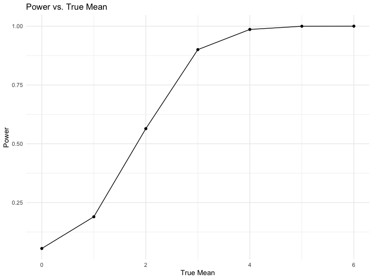
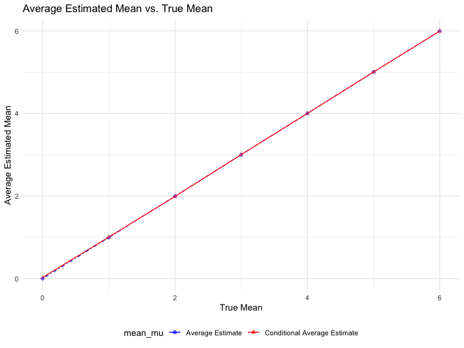

p8105_hw5_jl6325
================
Jianing Liu
2023-11-16

## Problem 1

For this problem, we are interested in data gathered and made public by
*The Washington Post* on homicides in 50 large U.S. cities. The code
chunk below imports and cleans the data.

``` r
homicide_df = 
  read_csv("data/homicide-data.csv", na = c("", "NA", "Unknown")) %>%
  mutate(
    city_state = str_c(city, state, sep = ", "),
    resolution = case_when(
      disposition == "Closed without arrest" ~ "unsolved",
      disposition == "Open/No arrest"        ~ "unsolved",
      disposition == "Closed by arrest"      ~ "solved"
    )
  ) %>% 
  filter(city_state != "Tulsa, AL") 
```

    ## Rows: 52179 Columns: 12
    ## ── Column specification ────────────────────────────────────────────────────────
    ## Delimiter: ","
    ## chr (8): uid, victim_last, victim_first, victim_race, victim_sex, city, stat...
    ## dbl (4): reported_date, victim_age, lat, lon
    ## 
    ## ℹ Use `spec()` to retrieve the full column specification for this data.
    ## ℹ Specify the column types or set `show_col_types = FALSE` to quiet this message.

The resulting dataframe has 52178 entries, on variables that include the
victim name, race, age, and sex; the date the homicide was reported; and
the location of the homicide. In cleaning, I created a `city_state`
variable that includes both city and state, and a `resolution` variable
to indicate whether the case was closed by arrest. I also excluded one
entry in Tulsa, AL, which is not a major US city and is most likely a
data entry error.

In the next code chunk, I group within cities and summarize to produce
the total number of homicides and the number that are solved.

``` r
city_homicide_df = 
  homicide_df %>% 
  select(city_state, disposition, resolution) %>% 
  group_by(city_state) %>% 
  summarize(
    hom_total = n(),
    hom_unsolved = sum(resolution == "unsolved"))
```

Focusing only on Baltimore, MD, I can use the `prop.test` and
`broom::tidy` functions to obtain an estimate and CI of the proportion
of unsolved homicides in that city. The table below shows those values.

``` r
bmore_test = 
  prop.test(
    x = filter(city_homicide_df, city_state == "Baltimore, MD") %>% pull(hom_unsolved),
    n = filter(city_homicide_df, city_state == "Baltimore, MD") %>% pull(hom_total)) 

broom::tidy(bmore_test) %>% 
  knitr::kable(digits = 3)
```

| estimate | statistic | p.value | parameter | conf.low | conf.high | method                                               | alternative |
|---------:|----------:|--------:|----------:|---------:|----------:|:-----------------------------------------------------|:------------|
|    0.646 |   239.011 |       0 |         1 |    0.628 |     0.663 | 1-sample proportions test with continuity correction | two.sided   |

Building on this code, I can use functions in the `purrr` package to
obtain estimates and CIs for the proportion of unsolved homicides in
each city in my dataset. The code below implements this analysis.

``` r
test_results = 
  city_homicide_df %>% 
  mutate(
    prop_tests = map2(hom_unsolved, hom_total, \(x, y) prop.test(x = x, n = y)),
    tidy_tests = map(prop_tests, broom::tidy)) %>% 
  select(-prop_tests) %>% 
  unnest(tidy_tests) %>% 
  select(city_state, estimate, conf.low, conf.high) %>% 
  mutate(city_state = fct_reorder(city_state, estimate))
```

Finally, I make a plot showing the estimate (and CI) of the proportion
of unsolved homicides in each city.

``` r
test_results %>% 
  mutate(city_state = fct_reorder(city_state, estimate)) %>% 
  ggplot(aes(x = city_state, y = estimate)) + 
  geom_point() + 
  geom_errorbar(aes(ymin = conf.low, ymax = conf.high)) + 
  theme(axis.text.x = element_text(angle = 90, hjust = 1))
```


This figure suggests a very wide range in the rate at which homicides
are solved – Chicago is noticeably high and, given the narrowness of the
CI, likely is the location of many homicides.

## Problem 2

``` r
q2 <-
  tibble(filename = list.files("data/data2"))

readfile <-
  function(csv, path = "data/data2") {
    paste(path, csv, sep = "/") |>
    read.csv()
  }
```

Set a function to read files.

``` r
longitudinal <-
  q2 |>
  mutate(longitudinal_df = map(q2$filename, readfile)) |>
  unnest(longitudinal_df) |> 
  mutate(arm = map_chr(.x = filename, ~ unlist(str_split(.x, "\\.") ) [[1]] )) |> 
  mutate(arm1 = map_chr(.x = arm, ~ unlist(str_split(.x, "_") ) [[1]] )) |> 
  mutate(subject_id = map_chr(.x = arm, ~ unlist(str_split(.x, "_") ) [[2]] )) |> 
  select(-filename, -arm)
```

``` r
pivot_longer = 
  longitudinal |> 
  pivot_longer(week_1:week_8,
               names_to = "week",
               names_prefix = "week_",
               values_to = "value") |> 
  mutate(week = as.integer(week))

plot = 
  pivot_longer |> 
  ggplot(aes(week, value, color = subject_id)) + 
  geom_line() + 
  facet_wrap(~arm1) + 
  labs(x = 'Week', y = 'Value', title = 'Spaghetti Plot', color = "Subject ID")
```

The comparison between the control and experimental arms reveals
distinct patterns. The control arm consistently exhibits lower values
across the eight weeks in contrast to the experimental arm, which
displays a general upward trend. Notably, the control arm demonstrates
higher variability and fluctuations throughout the study period, lacking
a discernible trend compared to the experimental arm’s clear increasing
trajectory.

## Problem 3

``` r
n <- 30
sigma <- 5
alpha <- 0.05
mus <- c(0, 1, 2, 3, 4, 5, 6)
set.seed(1)
sim_mean_sd = function(n, mu, sigma) {
  
  sim_data = tibble(
    x = rnorm(n, mean = mu, sd = sigma),
  )
  
  sim_data |> 
    summarize(
      mean_x = mean(x),
      sd_x = sd(x)
    )
}
```

``` r
ttest <- function(n, mu, sigma) {
  sample <- rnorm(n, mean = mu, sd = sigma)
  test_result <- t.test(sample, mu = 0)
  broom::tidy(test_result)
}
```

``` r
ttest_df <- tibble(mu = numeric(), mean_x = numeric(), p_value = numeric(), reject = logical())
```

``` r
for (mu in mus) {
  for (i in 1:5000) {
    sim_results <- sim_mean_sd(n, mu, sigma)
    rttest <- ttest(n, mu, sigma)
    ttest_df <- ttest_df %>% 
      add_row(mu = mu, 
              mean_x = sim_results$mean_x, 
              p_value = rttest$p.value, 
              reject = rttest$p.value < alpha)
  }
}
```

## Power Calculation

``` r
power <- ttest_df |>
  group_by(mu) |> 
  summarise(p = mean(reject), 
            mean_mu = mean(mean_x), 
            mean_mu_rejected = mean(mean_x[reject])
)
```

``` r
power |>
  ggplot(aes(x = mu, y = p)) +
  geom_point() +
  geom_line() +
  labs(
    title = "Power vs. True Mean", x = "True Mean", y = "Power"
    )
```


The graph illustrates a clear positive relationship: higher true mu
values correspond to an increased likelihood of rejecting the null
hypothesis (greater power). This alignment stems from larger effect
sizes, which inherently amplify statistical power, facilitating the
detection of significant differences more effectively.

``` r
power |>
  ggplot(aes(x = mu)) +
  geom_point(aes(y = mean_mu, color = "Average Estimate"), alpha = .5) +  
  geom_line(aes(y = mean_mu, color = "Average Estimate"), linetype = "dotdash") +
  geom_point(aes(y = mean_mu_rejected, color = "Conditional Average Estimate"), shape = 2, alpha = .5) +
  geom_line(aes(y = mean_mu_rejected, color = "Conditional Average Estimate")) +
  labs(
    title = "Average Estimated Mean vs. True Mean",
    x = "True Mean",
    y = "Average Estimated Mean",
    color = "mean_mu"
  ) +
  scale_color_manual(
    values = c("Average Estimate" = "blue", "Conditional Average Estimate" = "red")
  )
```


